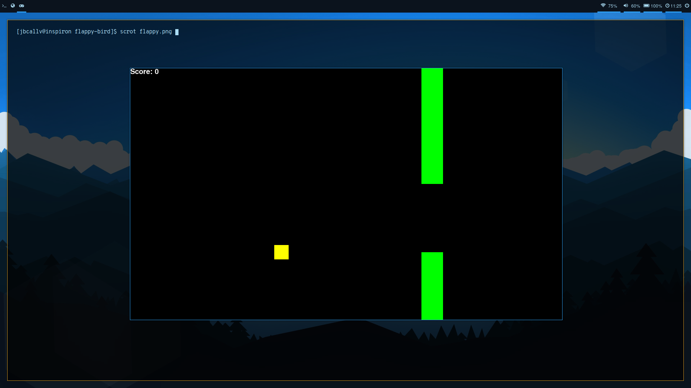

# flappy-bird
Flappy bird game implemented in Python with Pygame library


# dependencies
<ul>
  <li>python3</li>
  <li>pygame</li>
</ul>

# installation
- install all dependencies
- ```git clone https://github.com/jbcallv/flappy-bird.git```
- ```cd flappy-bird```
- ```python3 main.py```
